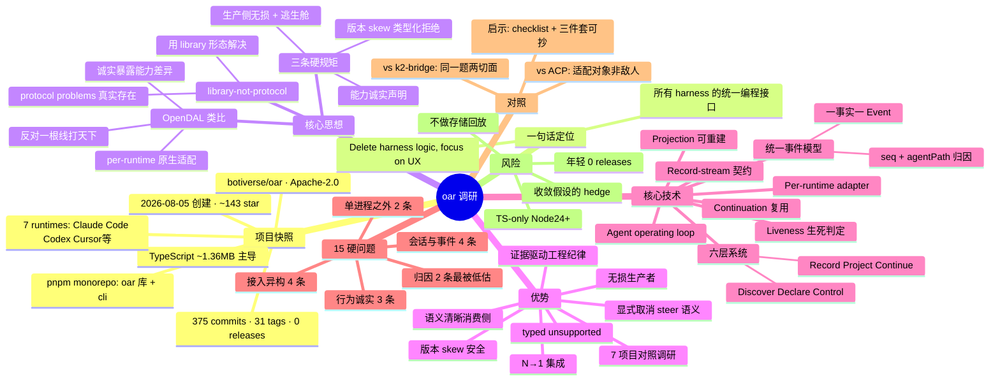

# oar-research

**oar (Open Agent Runtime) 调研报告**：给所有 coding-agent harness 做统一编程接口的 TypeScript library —— 它的优势与核心技术。

> 调研日期：2026-10-01 ｜ 对象版本：`botiverse/oar` main 分支（commit `1145e4e`）
> 一句话：**"Delete harness logic and focus on outcomes and UX."**

## 1. 项目快照（原始数）

| 项 | 数 |
|---|---|
| 仓库 | `botiverse/oar`（Organization 账号），Apache-2.0 |
| 创建 | 2026-08-05（约 2 个月） |
| Star / Fork / Watch | ~143 / 2 / 1（调研期间还在涨） |
| Commits / Tags / Releases | 375 / 31 / **0** |
| 语言 | TypeScript ~1.36MB（绝对主导），HTML/Python 少量 |
| 结构 | pnpm monorepo：`packages/oar`（`@botiverse/oar` 库）+ `packages/cli`（`@botiverse/oar-cli`）；`docs/`（design/spec/runtimes/prior-arts）、`experiments/`、`apps/arena`、`sea-trial/`、`tests/` |
| 支持的 runtime | Antigravity、Claude Code、Codex、Cursor、Grok Build、Kimi Code、Pi（7 个） |
| 运行要求 | ESM-only，Node.js 24+ |

## 2. 核心思想：library-not-protocol（OpenDAL 类比）

oar 反对的不是某个具体协议，而是这个天真想法：**"指望一根 wire protocol（比如 ACP）解决所有 harness 的差异"**。它的 motivation 写得很直白：

- 难的东西（无损事件流、会话恢复、sub-agent 归属、token 归因）**是真实存在的 protocol problems**——今天每个应用都在私下重复发明，而且发明得很烂（证据：某厂商自己的 ACP adapter 直接丢 sub-agent 事件；另一家的 usage 视图重叠到没法求和）。
- 但解法不是再造一根线，而是 **"protocol 的问题，用 library 的形态解决"**：每个 runtime 用原生方式接入（SDK / CLI / subprocess / app-server / ACP 变体），统一的只是进程内的编程契约。

这正是 @xuanwo 做 OpenDAL 的思想：S3-compatible 的坑在于"假装大家都一样"，library 的好处在于 **"可以诚实地不一样"**——per-backend 原生驱动，对外统一 API，但能力差异如实暴露，不被最小公分母封死。

oar 的三条硬规矩（赌注的具体化）：

1. **生产侧无损**：harness 发什么都保留，未知事件永不丢弃；`rawEvents()` / `records()` 随时直达原生 payload（逃生舱）。
2. **诚实的能力声明**：capability 表面声明每个 runtime 真实支持什么；弱的不硬撑，返回 typed `unsupported`；**绝不编造 runtime 没给的结构**。
3. **版本 skew 不静默出错**：支持窗口内工作，窗口外 typed reject，never silently wrong。

背后的赌注（它自己承认是 bet）：**创新集中在应用层，不在 harness 层**——各家 runtime 正在收敛（会话模型、事件流、sub-agent 模式、用量上报），剩下的差异恰好是协议能吸收的那种。如果赌错了（harness 持续分化），对冲就是上面三条：无损生产者 + per-runtime 能力声明，保证"runtime 暴露什么都不被墙挡住"。

## 3. 优势

1. **N→1 集成**：detect / install / version catalog / login / usage / config / session-drive，每个应用写一次，而不是"应用 × runtime"次。消费者永远不需要知道 harness 是走 SDK、CLI、subprocess 还是 app-server 驱动的。
2. **无损生产者，语义清晰的消费者**：一个事实对应一个 `Event`（text、reasoning、tool call 起止、turn 起止、usage、compaction、retry、control rejection、进程退出……），每个带 `seq` + `agentPath` 归因；"当前状态"是 over events 的 fold，不是另一份真相。
3. **不搞最小公分母**：强 harness 不被拖后腿，弱 harness 明确说不支持——调用方做的是知情决策，而不是在"假装统一"的接口上猜。
4. **取消/steer 语义显式**：每个控制动作有 typed acceptance 结果和已知的落点；被拒绝时输入物归原主（caller-owned），不凭沉默推断。
5. **版本 skew 安全**：support window + 窗口外 typed rejection。harness 发版导致行为漂移时，先报错而不是先算错。
6. **证据驱动的工程纪律**（同类项目里少见）：`experiments/` 是 live probe + 结论的实证库；`decisions.md` 记录"被拒绝的提案、为什么、什么证据能重开"；新 public surface 要过 decision gates 五问（调用方决策、反证据、归属层、回归成本、sea-trial 用例），答不上就回 roadmap 或 experiment。
7. **白送的选型调研**：`docs/prior-arts/feature-comparison.md` 把 7 个同类项目（Paseo、Lody、Synara、One Works、Orca、Herdr、Multica）按"接入抽象 / 会话恢复 / 事件保真 / 故障处理"逐功能对照，证据链完整。
8. **Host 零绑架**：不依赖 host 的 auth/命名/身份；不做存储与回放（只管 emit，persist 是 host 的事）；projection 是 disposable 的 read model，可随时从 record stream 重建。

## 4. 核心技术

### 4.1 六层系统（Discover → Declare → Control → Record → Project → Continue）

```
Discover（安装探测·auth·模型）→ Declare（能力·限制·证据）→ Control（会话·prompt·steer·queue·abort）
  → Record（有序无损流）→ Project（status·用量·上下文·图）→ Continue（cursor·resume·voyage·handoff）
  → 回到 Discover
```

箭头是信息依赖，不是调用顺序。关键所有权划分：**oar 拥有 adapter 的观察与 record 的公共语义；host 拥有调度、策略、持久化、多控制器仲裁和人机呈现**。projection 永远不准成为第二个真相源。

### 4.2 统一事件模型

`Session.events()` 是扁平、带归因的读法：`text_delta`、`tool_call_started`、`turn_ended`……每个事件带 `seq` 和 `agentPath`。`{ coalesceText: true }` 可把文本按块而非按片给。当 runtime 自己的帧语义重要时，`rawEvents()` / `records()` 暴露底层 record stream，原生 payload 逐字保留。

### 4.3 Record-stream 契约（`docs/spec/`）

design 文档管 *why*，spec 管 *what*：record 形状、归因、session graph、cursor。两者刻意分离——设计立场变了跟代码同 commit 改，契约形状另行版本化。

### 4.4 Per-runtime adapter（`docs/runtimes/`）

每个 runtime 一页：原生编程接口、原生概念、当前 oar 映射，以及"证据"。抽象不是拍脑袋的，是拿真机行为喂出来的（见 15 硬问题里的 vendor quirks）。

### 4.5 Liveness："它活着还是死了，为什么"

每个多 agent 应用都会撞上的稳定性问题。进程中途被杀会导致 dangling tool call（有开始无结束），消费者会 hang 在永远不会 settle 的状态上——oar 要求显式的 dispose 语义 + post-mortem records。操作循环里有一句狠话：**"Silence is unknown, never success."**

### 4.6 Projection 与 Continuation

- **Project**：conversation projection（给 chat UI 用的）、status/liveness/usage/context/graph，全是 over records 的 fold，可丢弃、可重建。
- **Continue**：cursor、可恢复的 native resume identity、voyage log、handoff——让工作可累积，崩掉的 worker 能 replay 继续，另一个 worker 能 inspect 同一份证据，人可以在控制边界介入而不重建隐藏的 adapter 状态。

### 4.7 Agent operating loop（人体工学单元）

不是单次 prompt，而是有界控制循环：Orient（只读决策所需的最小状态）→ Choose（按能力/证据/延迟/配额选 runtime）→ Act（发一个显式控制动作，先看 typed 回应再假设落地）→ Observe（消费有序流，重要决策保留 native record）→ Verify（查 runtime 自己的完成/错误/用量/liveness 事实）→ Checkpoint（persist cursor + voyage）→ Handoff（把 session 身份、cursor、下一步留给下一个人，包括不可恢复的 gap）。

## 5. 15 个硬问题（精华摘录）

`docs/design/hard-problems.md` 把"接一个 agent runtime"拆成 15 个独立的 protocol 问题，每个都配了真实 runtime 的反例。按组摘最扎眼的：

**接入层**
1. 接入机制异构：SDK / CLI / subprocess stdio / app-server / ACP 变体 / in-process library（pi）——光"怎么驱动它"就是 per-vendor 的调研，一家还常常同时给好几种。
2. detect / install / version catalog：版本间行为会变，要 support window + 窗口外 typed reject。
3. auth：每家登录流、凭证位置、过期行为都不同。
4. OS 矩阵：CI 矩阵抓到 3 个 Windows-only bug（powershell 参数解析、`.cmd` spawn EINVAL、teardown 竞态），Linux/macOS 上永远不出现。

**会话与事件模型**
5. session identity/resume 语义各异：codex resume 会 replay 全量历史，pi 的 fork 是 transcript 分支（不是 sub-agent），grok 是 session/load replay——resume 不是通用原语。
6. 事件词表没有共享语义：有些 harness 的 turn/run 边界是缺失的（pi、claude），**"自己合成边界"是陷阱**；未知事件必须保留、永不丢弃。
7. status 是推导出来的（fold over events），容易把控制流和事实流搞混。
8. 进程死亡边缘：中途杀进程 → dangling tool call → 需要显式 dispose 语义。

**归因（最被低估的一组）**
9. sub-agent 关联：光谱从不透明（kimi 自家的 ACP adapter **直接丢 sub-agent 事件**）到 fully nested child sessions（grok）；协议绝不能编造 runtime 没暴露的结构。
10. token/usage 会计：cumulative vs delta、child 用量算到 parent 头上，最坏情况是多份重叠的 usage 视图**不能求和**（grok）——usage 事实需要 provenance + canonical marker。

**行为诚实**
11. 能力差异：typed `unsupported`，不要最小公分母，也不要伪造支持。
12. 只有实测才抓得到的 vendor quirks：claude 的 401 静默重试、400 错误带着 subtype `"success"`、grok serve mode 无 client 连接时静默丢通知——文档不会告诉你，只有 conformance test 能钉住。
13. cancel vs steer vs interject：grok 有 interject + send_now 排队，别家根本不能 steer；每种与事件流的交互都不同。

**单进程之外**
14. context 管理：codex 的原生 compaction 事件；外部 compaction 连续性由 record-stream spec 定义。
15. placement：本地 co-process vs 远端服务 vs 托管云——session、process、host 是三个不同的生命周期层；多客户端 attach 需要 resumable cursor，否则就是 grok 式通知丢失。

## 6. 对照：ACP 与 k2-bridge

- **vs ACP**：oar 不反 ACP——"ACP 变体"只是它适配的 N 种接入机制之一。它的敌人是"指望一根线解决所有问题"的天真；ACP 可以是某条边，但统一发生在 library 的契约层，而不是 wire 上。
- **vs k2-bridge（@byted/k2-bridge，统一 Codex/Claude/ACP 协议适配）**：同一道题的两个切面。k2-bridge 是**协议适配层**（把各家协议翻译成内部统一语言），oar 是**库抽象层**（把各家原生机制收敛成编程契约 + 无损事件流）。给 k2 的直接启示：hard-problems 的 15 条可直接当 k2-bridge 的设计/test checklist 用；"诚实能力声明 + typed unsupported + 版本 skew 策略"三件套值得抄。

## 7. 风险与诚实边界（它自己写的 + 研判）

- **年轻**：约 2 个月，0 releases，API 还在 churn；141→143 star 还在涨，但生态位未稳。
- **TS-only**：多语言绑定是明确非目标；ESM-only + Node 24+。非 Node 技术栈只能看文档抄思想。
- **核心赌注风险**：赌 harness 层收敛、创新在应用层。若各家持续分化，library 要维护的 per-runtime quirks 会线性膨胀——它的 hedge（无损生产者 + 能力声明）能保"不错"，但保不了"不贵"。
- **不做存储/回放**：host 必须自己 persist `Session.events()`（或 voyage log），oar 只管 emit。
- **单 harness 场景不用它**：它的 honest boundary 写得很清楚——一个 harness 且原生 SDK 够用，直接调原生；2 个以上 runtime 才回本。

## 8. 思维导图



## 9. 信息来源

- 仓库：[botiverse/oar](https://github.com/botiverse/oar)（README、repo metadata、languages、目录结构）
- 设计文档：`docs/design/motivation.md`（赌注与三条规矩）、`hard-problems.md`（15 问题）、`decisions.md`（被拒绝的提案）、`system.md`（六层系统与 operating loop）、`liveness.md`、`roadmap.md`
- 契约与映射：`docs/spec/`（record-stream）、`docs/runtimes/`（per-runtime 映射与证据）
- 对照：`docs/prior-arts/feature-comparison.md`（2026-09-16，7 项目逐功能对照）
- 实证：`experiments/`（live probes + 结论）

*本报告基于公开仓库文档的研读与分析；"研判"部分为分析观点，非项目官方承诺。*
